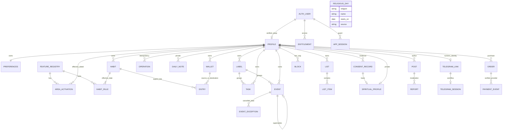

# ERD — baseline implementasi v0.6

Acuan: PRD v0.5 §16, §24–29 dan **Addendum PRD v0.6** (area, jadwal, tugas, catatan, Spiritual). Semua FK data pengguna menyertakan `owner_id`. ID identitas auth tetap stabil. Tidak ada cascade dari pengguna ke ledger/payment/audit/consent; penghapusan memakai workflow retensi yang belum disepakati.

Dokumen ini mengganti ERD baseline sebelumnya. Bagian bertanda **[ada]** sudah dimigrasikan. Bagian bertanda **[baru]** adalah rancangan v0.6 yang belum dimigrasikan. Nama kolom yang sudah ada harus dicocokkan dengan migrasi aktual sebelum menulis SQL; dokumen ini tidak mengasumsikan nama kolom lama selain yang tertulis di baseline sebelumnya.

`ENTRY` tidak digambar punya tabel anak baru. Tidur, olahraga, air, fasting, belajar, dan transaksi tetap satu tabel `entries` (lihat §B).

---

## A. Implementasi dan status

### A.1 Yang sudah ada **[ada]**
- `profiles`, `preferences`, `habits`, `habit_rules`, `wallets`, `entries`: fondasi data normalized. Entry jenis log/income/expense/transfer; transfer satu baris dengan dua dompet sehingga saldo derivasi atomik. Tidak ada salinan history.
- `private.account_access`, `private.entitlements`, `private.session_guards`, `private.roles`, `private.audit`, `private.operations`, `private.rate_buckets`: tidak diekspos Data API. Entitlement/grant eksplisit, aktor/alasan/tanggal audit. Session guard tidak otomatis diciptakan signup.
- `public.social_posts`, `private.social_cohorts`, `private.social_blocks`, `private.social_reports`, `private.social_avatars`: fondasi Feed development; akses lewat RPC server yang memeriksa sesi dan akses; Feed tetap OFF pada konfigurasi normal dan belum memenuhi gate peluncuran sosial.
- Core writes hanya melalui RPC server service-role yang dibatasi dengan owner/session/revision/idempotency dan validasi domain; klien authenticated hanya membaca data sendiri sesuai entitlement/session. Tanpa service key server, write ditolak. Tidak ada policy insert/update/delete terbuka.
- `app_snapshot` memakai `security_invoker`; belum ada read snapshot aktif sebelum account/session/grant valid.
- `telegram_links/sessions`, `orders/payment_events`: belum dimigrasikan; Payment/bot tetap disabled.

### A.2 Yang berubah di v0.6 **[baru]**
Lihat §B (perubahan skema), §C (aturan aktivasi), §D (pembacaan Riwayat), §E (RPC), §F (migrasi bertahap), §G (keterlacakan AC).

### A.3 Retensi dan penghapusan
Retensi log sensitif, deleted rows, idempotency, audit, **consent**, catatan harian, data Spiritual, dan invoice **belum diputuskan**. Semua tabel baru v0.6 masuk daftar ini. Tidak memasang auto-delete/cascade; baris pengguna memakai `deleted_at` (soft delete). Workflow "hapus data per area" dan "hapus akun" hanya dirancang (§E.3), belum diimplementasikan. Ini tetap blocker sebelum data nyata.

---

## B. Perubahan skema

### B.1 Tabel referensi sistem

**`public.feature_registry`** [baru] — daftar tetap area dan fitur, diisi lewat migrasi, **bukan** oleh klien.

| Kolom | Isi |
|---|---|
| `key` (PK) | `financial`, `health`, `working`, `education`, `home`, `feed`, `spiritual`; fitur bertitik: `health.workout` dst. |
| `parent_key` | Area induk untuk fitur; null untuk area |
| `kind` | `area` / `feature` |
| `default_enabled` | Berlaku bila pengguna belum punya baris aktivasi |
| `stage` | `live` / `coming_soon`. `coming_soon` ditolak oleh semua RPC |
| `consent_purpose` | Tujuan persetujuan yang disyaratkan (null bila tidak ada) |

Isi awal:

| key | parent | default | stage | consent |
|---|---|---|---|---|
| `financial` | — | ya | live | `financial` |
| `health` | — | ya | live | `health` |
| `education` | — | ya | live | — |
| `working` | — | ya | coming_soon (live saat gelombang B) | — |
| `home` | — | ya | coming_soon (live saat gelombang B) | — |
| `spiritual` | — | tidak | coming_soon | `spiritual` |
| `feed` | — | tidak | gating tambahan: flag server + `social_cohorts` | — |
| `health.workout`, `.water`, `.fasting`, `.sleep`, `.journal` | health | ya | live | — |
| `education.study`, `.schedule`, `.tasks`, `.summary` | education | ya | live (schedule/tasks/summary saat gelombang B) | — |
| `working.schedule`, `.tasks` | working | ya | coming_soon | — |
| `working.log` | working | **tidak** | coming_soon | — |
| `home.schedule`, `.tasks`, `.shopping` | home | ya | coming_soon | — |

Pemetaan dari tombol "Modul aktif" saat ini: Olahraga → `health.workout`, Air → `health.water`, Fasting → `health.fasting`, Refleksi → `health.journal`, Belajar → `education.study`, Keuangan → `financial`. **"Kebiasaan" adalah inti, bukan kunci registry** dan tidak bisa dimatikan.

`stage` berubah hanya lewat migrasi/operasi, bukan klien (AC47, AC52).

### B.2 Aktivasi dan preferensi

**`public.area_activations`** [baru] — riwayat aktif/nonaktif, efektif-bertanggal.

| Kolom | Isi |
|---|---|
| `id`, `owner_id` | |
| `key` | FK → `feature_registry.key` |
| `effective_from` | `date` lokal pengguna |
| `enabled` | boolean |
| `created_at`, `operation_id` | idempotency |

- Unik `(owner_id, key, effective_from)`.
- Keadaan pada tanggal D = baris terbaru dengan `effective_from <= D`; bila tidak ada baris, pakai `default_enabled`.
- Fitur aktif pada D bila **area induk aktif pada D** dan fitur aktif pada D.
- **Append-only untuk masa lalu:** baris dengan `effective_from` sebelum hari lokal tidak boleh diubah atau dihapus. Baris dengan tanggal hari ini/masa depan boleh diganti. RPC menolak `effective_from` sebelum hari lokal pengguna (tidak ada menulis ulang sejarah).
- Menyalakan area `health`/`financial`/`spiritual` mensyaratkan `consent_records` aktif untuk `consent_purpose` (§B.9).

**`public.preferences`** [ada, diperluas] — kolom baru: `nav_order text[]` (urutan tab), `dashboard_hidden text[]` (area aktif tanpa kartu di Dashboard), `time_format` (12/24), `hide_amounts boolean`. Isi array divalidasi RPC terhadap registry. Kolom pengaturan "modul aktif" lama diganti oleh `area_activations` lalu dihapus (§F).

### B.3 Kebiasaan **[ada, diperluas]**

**`habit_rules`** (efektif-bertanggal; sudah unik `owner/habit/effective`) mendapat kolom:

| Kolom | Isi |
|---|---|
| `area` | FK → registry (kind=`area`, bukan `feed`/`spiritual` untuk habit berbasis modul) |
| `recurrence_type` | `weekdays` (default; semua 7 hari = harian) atau `interval` |
| `weekdays` | Jadwal 0=Minggu…6=Sabtu yang sudah ada (dipakai bila `weekdays`) |
| `interval_days`, `interval_anchor` | N=2–30 dan tanggal jangkar (dipakai bila `interval`) |
| `start_time`, `duration_min` | Opsional; waktu mulai dan durasi rutinitas |

- `area` ada di **versi aturan**, bukan di `habits`. Alasannya: memindahkan habit ke area lain membuat versi baru mulai hari efektif, sehingga progres tanggal lampau tidak berubah (area aktif pada tanggal lampau dinilai terhadap area saat itu). Ini yang menjamin AC49.
- Constraint: `recurrence_type='weekdays'` ⇒ `weekdays` tidak kosong dan kolom interval null; `'interval'` ⇒ `interval_days` 2–30 dan anchor terisi, `weekdays` null; `duration_min` hanya bila `start_time` terisi; `duration_min` 1–1440.
- Habit berbasis modul: `area` harus sesuai peta source→area (`workout`/`water`/`fasting`→`health`, `study`→`education`, checklist keuangan→`financial`). Habit custom boleh area apa pun kecuali `feed`/`spiritual`-spesifik aturan di bawah.
- **`habits.template_key`** [baru]: nullable. Unik parsial `(owner_id, template_key)` untuk habit aktif/tidak diarsipkan dan tidak terhapus (AC49).
- Habit dengan `area='spiritual'` hanya boleh dibuat setelah `spiritual` aktif dan consent aktif.
- Terjadwal pada D = habit aktif pada D (versi aturan efektif) dan `recurrence` cocok dan **area aktif pada D** dan fitur sumbernya aktif pada D. Tidak ada status "jeda" pada habit; jeda diturunkan dari `area_activations` (AC39).
- Constraint yang sudah ada tetap: unik hidrasi aktif; checklist satu entry hidup per habit/tanggal.

### B.4 `entries` **[ada, diperluas]**

Tetap satu tabel untuk log/income/expense/transfer: olahraga, air, belajar, fasting, tidur, habit manual, dan transaksi.

| Perubahan | Isi |
|---|---|
| `started_at`, `ended_at` (timestamptz, nullable) | **Menutup gap "fasting actual range belum tersimpan"** dan dipakai tidur. Constraint: keduanya null atau keduanya terisi, `ended_at > started_at`; bila durasi (`amount` menit) juga ada, selisihnya konsisten (toleransi 1 menit, diperiksa di RPC) |
| `module` baru: `sleep` | Satuan menit. Tidak ada sumber habit `sleep` di rilis pertama; habit tidur teratur memakai checklist manual |
| `area` (FK registry, not null) | Disimpan saat tulis, **tidak berubah** setelah itu, seperti `local_date`. Untuk modul: dari peta module→area. Untuk habit manual: area dari versi aturan habit pada `local_date`. Memudahkan filter Riwayat dan pengecualian Spiritual tanpa join historis |
| Aturan `local_date` per modul | `fasting`: tanggal lokal **mulai**. `sleep`: tanggal lokal **bangun** (`ended_at`). Lainnya: seperti sekarang. Dihitung RPC saat tulis dan disimpan; ubah zona waktu tidak menggeser |
| Modul `reflection` | **Dihentikan** untuk tulis baru; dimigrasikan ke `daily_notes` (§B.5), lalu nilai dihapus dari daftar modul setelah verifikasi |

Peta module→area: `workout`/`water`/`fasting`/`sleep` → `health`; `study` → `education`; income/expense/transfer → `financial`. Peta module→fitur: `workout`→`health.workout`, `water`→`health.water`, `fasting`→`health.fasting`, `sleep`→`health.sleep`, `study`→`education.study`.

### B.5 Catatan harian

**`public.daily_notes`** [baru] — menggantikan entry `reflection`.

| Kolom | Isi |
|---|---|
| `id`, `owner_id` | |
| `kind` | `reflection` / `study_summary` / `work_log` |
| `area` | Dari kind: `health` / `education` / `working` (check) |
| `local_date`, `timezone` | Tanggal historis tersimpan |
| `body` | Maks 2.000 karakter |
| `mood` | Hanya `reflection`; himpunan nilai sama dengan yang dipakai UI saat ini (disalin dari `entries.name` lama setelah validasi) |
| `gratitude` | Hanya `reflection`, maks 1.000 karakter |
| `version`, `created_at`, `updated_at`, `deleted_at` | Konflik edit dan soft delete |

- Unik parsial `(owner_id, kind, local_date)` bila `deleted_at is null` (AC45). Penyimpanan ulang memakai upsert dengan versi, bukan insert ganda.
- Check: `mood` dan `gratitude` null bila `kind <> 'reflection'`.
- Tidak ada `label_id`: satu rangkuman per tanggal, label tidak bermakna (menyesuaikan Addendum §4.5).
- Privat. Tidak ada kolom isi yang boleh masuk log (§E.4).

### B.6 Label, tugas, jadwal

**`public.labels`** [baru]

| Kolom | Isi |
|---|---|
| `id`, `owner_id`, `area` (education/working/home), `name` (≤40), `archived_at`, `created_at` | |

Unik `(owner_id, area, id)` untuk FK komposit; unik parsial `(owner_id, area, lower(name))` untuk label tidak diarsipkan. Label yang dirujuk tidak bisa dihapus (FK `RESTRICT`), hanya diarsipkan.

**`public.tasks`** [baru]

| Kolom | Isi |
|---|---|
| `id`, `owner_id`, `area` | `area` ∈ {`working`, `education`, `home`} (check) |
| `title` (wajib), `description` (≤2.000) | |
| `due_date`, `due_time` | Opsional; **jam dinding**, bukan UTC |
| `priority` | 0 rendah / 1 normal / 2 tinggi, default 1 |
| `status` | `open` / `done` |
| `completed_at`, `completed_timezone`, `completed_local_date` | Terisi ⇔ `status='done'`; `completed_at` tidak boleh di masa depan |
| `label_id` | FK komposit `(owner_id, area, label_id)` → `labels(owner_id, area, id)` |
| `version`, `created_at`, `updated_at`, `deleted_at` | |

- "Lewat tenggat" tidak disimpan; diturunkan saat baca (AC44).
- Tugas selesai muncul di Riwayat lewat `completed_local_date`.
- Indeks: `(owner_id, status, due_date)` parsial `deleted_at is null`.
- Tugas **tidak** punya area `spiritual` dan tidak dihitung dalam progres harian.

**`public.events`** [baru] — Jadwal. Kejadian **diturunkan**, bukan disimpan per baris.

| Kolom | Isi |
|---|---|
| `id`, `owner_id`, `area` | `area` ∈ {`working`, `education`, `home`, `spiritual`} |
| `title`, `location`, `note` | |
| `start_time` (nullable), `duration_min` (1–1440, nullable) | Jam dinding. `start_time` null = sepanjang hari. Durasi (bukan `end_time`) memungkinkan **shift malam melewati tengah malam** |
| `recurrence_type` | `once` / `weekdays` / `interval` |
| `weekdays`, `interval_days` | Sama aturan dengan `habit_rules` |
| `valid_from` (not null), `valid_until` (nullable) | Masa berlaku (semester). `once`: `valid_until = valid_from`. `interval`: jangkar = `valid_from` |
| `label_id` | FK komposit seperti tugas |
| `supersedes_event_id` | Self-FK (pemilik sama) untuk rantai "Seterusnya" |
| `version`, `created_at`, `updated_at`, `deleted_at` | |

- Edit "Seterusnya": RPC mengatur `valid_until = D-1` pada baris lama dan membuat baris baru dalam satu transaksi. Tidak ada operasi yang mengubah tanggal lampau (AC43).
- Edit "Kejadian ini saja": `event_exceptions` untuk tanggal itu ditambah satu baris `once` baru bila waktunya diubah.
- Jadwal **tidak** masuk Riwayat dan tidak membuat entry.
- Area `spiritual` mensyaratkan `spiritual` aktif dan consent aktif.

**`public.event_exceptions`** [baru]: `id`, `owner_id`, `event_id` (FK komposit `(owner_id, event_id)`), `on_date`, `created_at`. Unik `(owner_id, event_id, on_date)`.

### B.7 Daftar belanja

**`public.lists`** [baru]: `id`, `owner_id`, `area` (check = `home`), `kind` (`shopping`), `title`, `archived_at`, `version`, `created_at`, `deleted_at`.
**`public.list_items`** [baru]: `id`, `owner_id`, `list_id` (FK komposit), `text`, `checked`, `checked_at`, `position`, `version`, `deleted_at`.

**Tidak ada FK ke `entries`.** "Catat sebagai pengeluaran" hanya membuka form transaksi terisi awal; transaksi dibuat lewat RPC transaksi biasa setelah pengguna mengonfirmasi (AC53).

### B.8 Spiritual

**`private.spiritual_profiles`** [baru] — di skema `private`, dibaca dan ditulis hanya lewat RPC (bukan RLS Data API) karena sensitivitas.

| Kolom | Isi |
|---|---|
| `owner_id` (PK) | |
| `religion` | `islam`, `kristen`, `katolik`, `hindu`, `buddha`, `konghucu`, `custom` |
| `custom_label` | ≤40; wajib bila `custom`, null selain itu |
| `consent_id` | FK ke `consent_records` (persetujuan aktif untuk `spiritual`) |
| `version`, `created_at`, `updated_at` | |

**`public.religious_days`** [baru] — data sistem tanpa data pengguna; read-only untuk klien.

| Kolom | Isi |
|---|---|
| `religion`, `name`, `starts_on`, `ends_on` | |
| `source` (not null), `verified_at` (not null) | **Tidak ada baris tanpa sumber terverifikasi** |

Kosong sampai sumber dan metode diputuskan (Addendum §14). Unik `(religion, name, starts_on)`.

Item Spiritual lain (salat, tilawah, ibadah mingguan) memakai tabel yang sudah ada: `habits` dan `events` dengan `area='spiritual'`; log centangnya di `entries.area='spiritual'`.

### B.9 Persetujuan

**`private.consent_records`** [baru] — append-only, bukti persetujuan (PRD §26).

| Kolom | Isi |
|---|---|
| `id`, `owner_id` | |
| `purpose` | `health`, `financial`, `spiritual`, `telegram` |
| `policy_version`, `granted_at`, `withdrawn_at` | |
| `operation_id` | idempotency |

- Unik parsial `(owner_id, purpose)` bila `withdrawn_at is null`. Versi baru = baris baru; pencabutan mengisi `withdrawn_at`.
- Pencabutan menonaktifkan penulisan baru area terkait (RPC memeriksa), tidak menghapus data. Retensi bukti persetujuan: lihat §A.3.
- Tidak ikut cascade penghapusan pengguna.

### B.10 Pengecualian Feed

Snapshot Feed [ada] hanya mengambil sumber: sesi olahraga/belajar, total air, status centang habit, dan **hitungan** tugas selesai. RPC publish menolak sumber dengan `area='spiritual'`, daftar tugas/judul/deskripsi, dan `daily_notes`. Bila tabel snapshot menyimpan area sumber, tambahkan check `source_area <> 'spiritual'`.

---

## C. Aturan aktivasi (satu fungsi acuan)

`private.is_key_active(owner_id, key, local_date)` dipakai oleh RPC tulis, ringkasan Dashboard, perhitungan progres, dan menu bot. Tidak ada implementasi ganda di aplikasi.

| Operasi | Aturan |
|---|---|
| **Buat baru** (entry, habit, tugas, jadwal, catatan, item daftar) | Ditolak bila `stage='coming_soon'`, atau kunci/area tidak aktif **hari ini**, atau consent yang disyaratkan tidak aktif. Termasuk mengisi tanggal lampau untuk area yang kini nonaktif (aktifkan dulu) |
| **Ubah/hapus yang sudah ada** | Diizinkan walau area nonaktif (koreksi lewat Riwayat, PRD v0.5 §7), tetap memeriksa pemilik/sesi/akses/versi |
| **Baca** | Selalu untuk pemilik dengan akses aktif; area nonaktif tetap terbaca di Riwayat dan ekspor |
| **Progres harian** | Habit dihitung hanya bila terjadwal **dan** area/fitur aktif pada tanggal itu; selain itu tidak dihitung dan tidak dianggap gagal |
| **Menu Telegram** | Item = {habit/centang, olahraga, air, fasting, belajar, keuangan} ∩ kunci aktif. Spiritual, tugas, jadwal, jurnal, dan tidur tidak ada di bot |

`set_area_activation` menawarkan tiga cabang saat ada habit aktif: **Batal** (tidak menulis apa pun), **Jeda** (hanya menulis baris `area_activations`), **Arsipkan** (menulis baris aktivasi **dan** versi aturan habit berstatus arsip mulai tanggal efektif, dalam satu transaksi).

---

## D. Pembacaan Riwayat dan ringkasan

Tidak ada salinan history. Riwayat dan kartu Dashboard membaca satu **view/RPC `history_items`** (`security_invoker`) yang menyatukan:

| Sumber | Masuk Riwayat? | Tanggal |
|---|---|---|
| `entries` tidak terhapus | Ya | `local_date` |
| `tasks` berstatus `done` | Ya | `completed_local_date` |
| `daily_notes` tidak terhapus | Ya | `local_date` |
| `events` dan `event_exceptions` | **Tidak** (jadwal bukan bukti kejadian) | — |
| `list_items` | Tidak | — |

Kolom keluaran: `owner_id`, `kind`, `area`, `local_date`, `occurred_at`, `ref_table`, `ref_id`, ringkasan. Pagination stabil `(occurred_at, id)`. Area nonaktif tetap muncul. Filter area memakai kolom `area` yang tersimpan, bukan join historis. Total keuangan Riwayat dan Keuangan tetap dari fungsi domain yang sama (AC12). Kartu Dashboard memanggil fungsi domain yang sama dengan halaman area (AC40).

---

## E. RPC, keamanan, dan log

### E.1 RPC baru (service-role, pola `owner/session/revision/idempotency` yang sama)
`set_area_activation`, `set_nav_preferences`, `save_habit` (diperluas: area, recurrence, waktu, template), `save_task` / `set_task_status`, `save_event` / `end_event_series` / `cancel_event_on_date`, `save_label` / `archive_label`, `save_daily_note`, `save_list` / `save_list_item`, `save_sleep` (memakai jalur entry), `grant_consent` / `withdraw_consent`, `set_spiritual_profile`, `history_items`. Semua aksi tulis membawa `operation_id` agar retry tidak menggandakan (AC14).

### E.2 RLS dan grant
- Tabel `public` baru (`area_activations`, `labels`, `tasks`, `events`, `event_exceptions`, `daily_notes`, `lists`, `list_items`): RLS select hanya pemilik **dan** sesuai entitlement/session; **tanpa** grant insert/update/delete untuk `anon`/`authenticated`.
- `private.spiritual_profiles`, `private.consent_records`: tanpa grant Data API; RPC saja.
- `feature_registry`, `religious_days`: select untuk `authenticated`, tanpa tulis.
- FK komposit `(owner_id, …)` mencegah tautan lintas pemilik, termasuk label→tugas/jadwal dan item→daftar (AC44).
- Moderator/admin/support: tidak ada jalur baca ke tabel-tabel ini (PRD v0.5 §25).

### E.3 Hapus data per area dan hapus akun (rancangan)
`delete_area_data(owner, area)` dan alur hapus akun mengikuti retensi yang belum diputuskan: reauth, ekspor ditawarkan, sesi/bot dicabut. **Keuangan tidak boleh dihapus massal sebelum keputusan retensi ledger.** Tidak diimplementasikan sebelum §A.3 selesai.

### E.4 Larangan log
RPC dan aplikasi tidak mencatat `title`, `description`, `body`, `gratitude`, `mood`, `text` item daftar, `religion`, `custom_label`, maupun nominal. Audit hanya metadata minimum (PRD v0.5 §15, AC48).

---

## F. Migrasi bertahap (expand → backfill → contract)

| Tahap | Gelombang | Isi |
|---|---|---|
| **M1** | A | `feature_registry` + isi awal; `area_activations`; kolom `preferences` baru; `habit_rules` (area, recurrence, waktu); `habits.template_key`; `entries.area/started_at/ended_at` + modul `sleep`; `is_key_active`; RPC aktivasi/preferensi; `history_items` v1 |
| **M1 backfill** | A | Seed `area_activations` dari kolom "modul aktif" lama, efektif sejak tanggal profil dibuat (riwayat penonaktifan tidak tersedia, tidak masalah karena data masih sintetis). `entries.area` dari peta module→area; habit manual dari area habit. **Habit custom lama yang tak punya area: isi sementara `health`** (data sintetis, bisa diubah pengguna) |
| **M2** | A/B | `daily_notes` + salin entry `reflection` → `daily_notes` (verifikasi jumlah, lalu hentikan tulis `reflection` dan hapus nilai modul); `consent_records` |
| **M3** | B | `labels`, `tasks`, `events`, `event_exceptions`, `lists`, `list_items` + RPC. Bangun dahulu untuk Education, lalu aktifkan Working dan Home hanya dengan mengubah `stage` registry |
| **M4** | C | `spiritual_profiles`, `religious_days` (kosong). `stage` tetap `coming_soon` sampai gerbang §5.8 Addendum selesai |
| **M5** | setelah retensi | Workflow hapus per area/akun |
| **Contract** | setelah M1–M2 lulus | Hapus kolom modul aktif lama dan nilai modul `reflection` |

Setiap tahap: migrasi reversible bila memungkinkan, uji RLS dan grant sebelum fitur dinyalakan, tidak ada cascade ke ledger/audit/consent.

---

## G. Keterlacakan AC → mekanisme

| AC | Mekanisme utama |
|---|---|
| AC38 | `is_key_active` pada semua RPC buat-baru; baca tetap dibuka; registry `stage` |
| AC39 | `set_area_activation` tiga cabang; jeda diturunkan dari `area_activations` efektif-bertanggal, riwayat tidak ditulis ulang |
| AC40, AC41 | `history_items`/fungsi domain tunggal; progres hanya dari habit; tugas/jadwal/Spiritual tidak masuk |
| AC42 | `recurrence_type`, `interval_*` + constraint; versi aturan efektif-bertanggal |
| AC43 | `events.valid_until`, `supersedes_event_id`, `event_exceptions`; jam dinding tanpa konversi |
| AC44 | FK komposit label, `version`, `completed_local_date`, RLS pemilik |
| AC45 | Unik parsial `daily_notes (owner, kind, local_date)` + upsert berversi |
| AC46 | `entries.started_at/ended_at`, `local_date` = tanggal bangun disimpan saat tulis |
| AC47 | `stage='coming_soon'`, consent aktif disyaratkan, `spiritual_profiles` hanya RPC |
| AC48 | Skema `private`, larangan log (§E.4), pengecualian snapshot (§B.10), allowlist bot (§C) |
| AC49 | `template_key` unik parsial; `area` di versi aturan habit |
| AC50 | §E.3 (rancangan; menunggu retensi) |
| AC51 | `preferences` + `area_activations` tersimpan server, berlaku lintas perangkat |
| AC52 | Registry `feed` + `social_cohorts` + flag server; klien tidak menentukan |
| AC53 | Tidak ada FK/otomatisasi daftar → `entries` |

---

## H. Constraint dan lifecycle (diperbarui)

- Habit rules unik owner/habit/effective; jadwal 0=minggu sampai 6=sabtu (tampilan minggu Senin–Minggu hanya di UI); hydration active unik; `template_key` unik parsial.
- Habit source sama dengan entry module jika terkait; checklist satu entry hidup per habit/date; semua nominal integer positif. Deleted entries tetap untuk koreksi/version dan tidak dihitung summary.
- Wallet/kategori dipertahankan lewat arsip; label dipertahankan lewat arsip; kategori baseline teks tervalidasi belum katalog terkelola, harus diperluas sebelum AC katalog penuh.
- Entries menyimpan UTC, timezone, `local_date` historis, **dan `area` historis**. Rentang aktual fasting/tidur disimpan di `started_at/ended_at` (gap lama tertutup oleh M1). Tugas dan catatan menyimpan tanggal lokal historis; jadwal dan tenggat memakai jam dinding.
- Core commit atomic, version account untuk konflik keseluruhan + version entry; baris baru (tugas, jadwal, catatan, daftar) memakai version baris dan mengikuti pola commit core yang ada. Read total dihitung dari ledger di domain, tidak cache saldo.
- Aktivasi area/fitur efektif-bertanggal, append-only untuk masa lalu.
- Post sosial memiliki versi untuk edit/hapus, `created_at` untuk pagination, dan ID snapshot sumber opsional. Laporan serta aksi moderasi disimpan terpisah dari log sumber; blokir dua arah diterapkan saat feed dibaca.

---

## I. Penyesuaian terhadap Addendum v0.6 (ERD menang untuk bentuk fisik)

| Addendum §10 | Realisasi ERD | Alasan |
|---|---|---|
| `sleep_session` tabel terpisah | Modul `sleep` di `entries` + `started_at/ended_at` | `entries` sudah punya UTC, timezone, `local_date`, versi, idempotency; sekaligus menutup gap fasting |
| `area_activation` memuat urutan dan "tampil di Dashboard" | Riwayat aktivasi di `area_activations`; urutan/tampilan di `preferences` | Urutan dan tampilan tidak butuh efektif-bertanggal |
| Area habit di habit | Area di `habit_rules` | Pindah area tidak boleh mengubah progres lampau (AC49) |
| `daily_note` mencakup label | Tanpa label | Satu rangkuman per tanggal |
| Jadwal dengan `end_time` | `start_time` + `duration_min` | Shift malam melewati tengah malam |
| `entries` tanpa area | `entries.area` tersimpan | Filter Riwayat dan pengecualian Spiritual tanpa join historis |
| `spiritual_profile` biasa | Skema `private`, RPC-only | Sensitivitas; mengurangi risiko salah konfigurasi RLS |
| `daily_note` untuk reflection | Entry `reflection` dimigrasikan ke `daily_notes` | Satu tempat untuk semua catatan harian; gratitude butuh kolom sendiri |

---

## J. Keputusan terbuka yang memengaruhi skema

1. Retensi dan penghapusan (§A.3), termasuk bukti consent dan ledger.
2. Himpunan nilai `mood` final dan apakah perlu dibatasi di DB (check) atau hanya di RPC.
3. Sumber `religious_days` dan jam salat (manual vs perhitungan), serta apakah perlu menyimpan lokasi.
4. Default area habit custom lama saat migrasi (sementara `health`).
5. Kanal pengingat: bila diputuskan ada, butuh tabel jadwal pengingat dan consent tambahan; belum dirancang di ERD ini.
6. Mengenai `daily_notes.mood`: apakah mood tetap opsional dan boleh tanpa `body`.